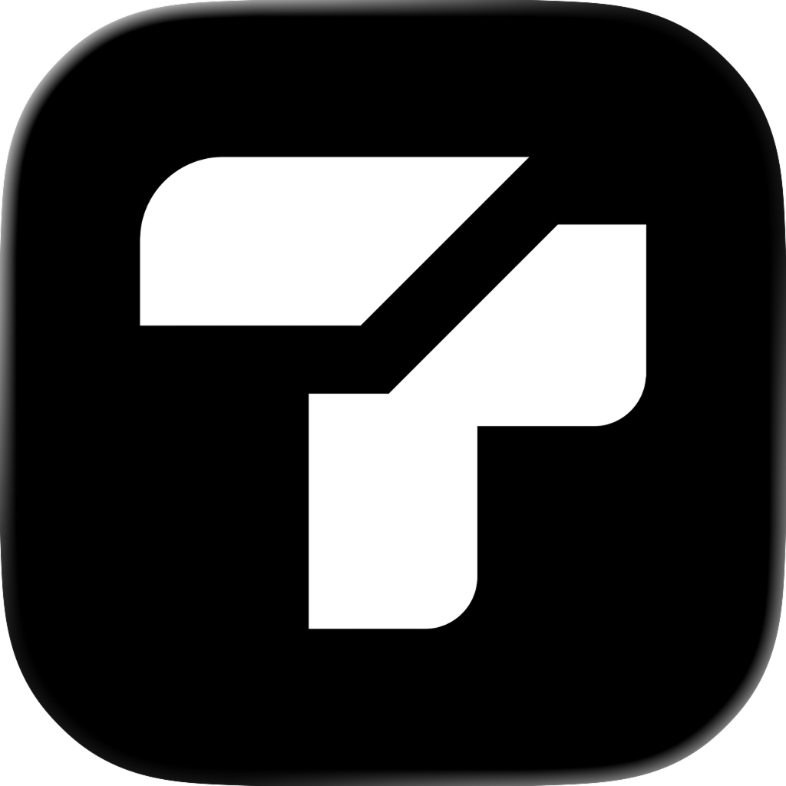
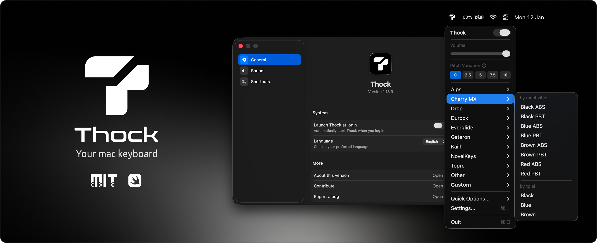
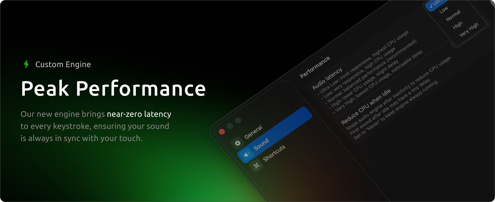
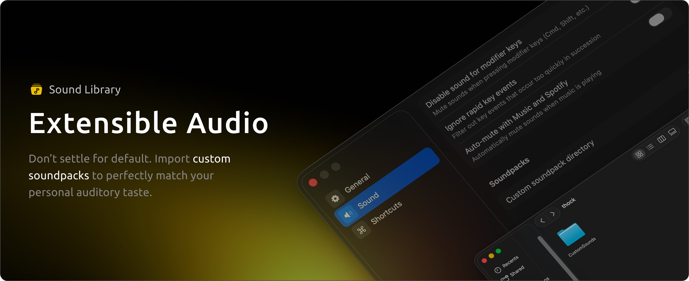
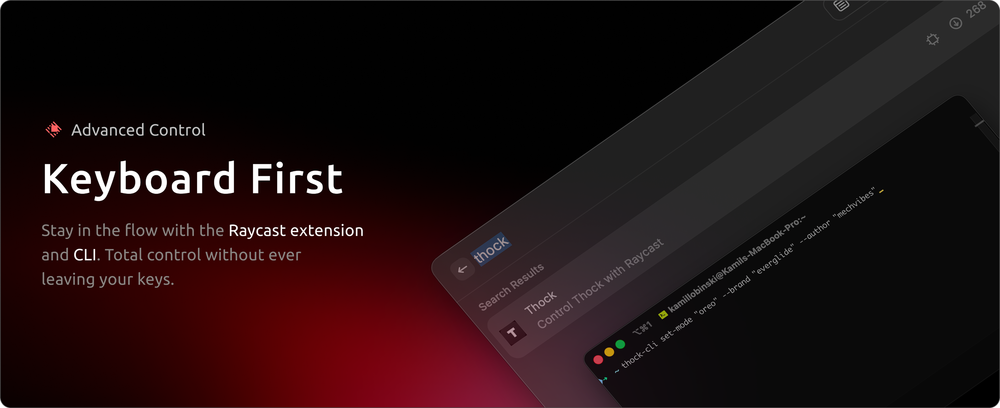

<a name="readme-top"></a>

<!-- PROJECT LOGO -->
<br />
<div align="center">
  
  <h3 align="center">Ruock</h3>
  <p align="center">
    A native macOS utility that adds sound effects to your keyboard.
    <br />Blazing fast, lightweight and runs in the menu bar.
    <br /><br />
    <a href="https://github.com/ded-furby/ruock/releases/latest" target="_blank" rel="noopener noreferrer">
      
    </a>
    <a href="#" target="_blank" rel="noopener noreferrer">
      
    </a>
  </p>
</div>


<!-- TABLE OF CONTENTS -->
<details>
  <summary>Table of Contents</summary>
  <ol>
    <li><a href="#about-the-project">About The Project</a></li>
    <li>
      <a href="#features">Features</a>
      <ul>
        <li><a href="#custom-engine">Custom Engine</a></li>
        <li><a href="#sound-library">Sound Library</a></li>
        <li><a href="#preview-the-sounds">Preview The Sounds</a></li>
        <li><a href="#smart-integration">Smart Integration</a></li>
        <li><a href="#advanced-control">Advanced Control</a></li>
        <li><a href="#translation">Translation</a></li>
      </ul>
    </li>
    <li><a href="#getting-started">Getting Started</a></li>
    <li><a href="#license">License</a></li>
    <li><a href="#contributing">Contributing</a></li>
  </ol>
</details>


<!-- ABOUT THE PROJECT -->
## About The Project



Ruock is a high-performance utility designed to bring the tactile satisfaction of mechanical switches to your macOS workspace. Built natively in Swift, it bridges the gap between hardware feel and software execution with zero compromises on speed or privacy.

By focusing on a custom low-latency engine and deep system integration, Ruock offers a professional-grade typing experience that stays out of your way and keeps your flow state intact.

> 🍺 Homebrew: <code>brew install --cask ded-furby/ruock/ruock</code><br/>
> 🔊 Hear it first: <a href="https://ded-furby.github.io/ruock-soundpacks/">preview every soundpack in your browser</a> — no download needed.

<p align="right">(<a href="#readme-top">back to top</a>)</p>


<!-- FEATURES -->
## Features

<details>
<summary>Quick Overview (if you don't feel like scrolling today)</summary>
<br/>
<table>
  <thead>
    <tr>
      <th width="300px">Feature</th>
      <th width="700px">Description</th>
    </tr>
  </thead>
  <tbody>
    <tr>
      <td><b>Custom Engine</b></td>
      <td>Native AudioQueue APIs achieving ultra-low latency for perfectly synced feedback.</td>
    </tr>
    <tr>
      <td><b>Sound Library</b></td>
      <td>Extensible JSON-based architecture to import or create custom switch profiles.</td>
    </tr>
    <tr>
      <td><b>Sound Previews</b></td>
      <td>Listen to every soundpack in the browser before installing anything.</td>
    </tr>
    <tr>
      <td><b>Smart Integration</b></td>
      <td>Music awareness that automatically mutes audio during playback.</td>
    </tr>
    <tr>
      <td><b>Advanced Control</b></td>
      <td>Hands-on-keys management via a dedicated CLI.</td>
    </tr>
    <tr>
      <td><b>Translation</b></td>
      <td>Fully localized interface for English, Español, Français, 日本語, 中文, Deutsch, Italiano and Vietnamese users.</td>
    </tr>
  </tbody>
</table>
</details>




### Custom Engine

Features a custom audio engine built on native macOS AudioQueue APIs, achieving ultra-low latency that feels instantaneous. By bypassing standard high-level processing layers, perceptual lag is eliminated to provide perfectly synced auditory feedback.

Whether you are a high-speed programmer or a creative writer, Ruock ensures every keystroke is met with organic, realtime sound that keeps pace with your fastest workflow.

<p align="right">(<a href="#readme-top">back to top</a>)</p>




### Sound Library

Built to be an open platform. Browse and install high-quality switch recordings straight from the in-app library — Alps, Cherry MX, Topre, Holy Panda and many more.

With support for custom sound packs, you can easily import new switch profiles or create your own using a simple JSON structure. Whether you want the deep resonance of a vintage board or a completely unique experimental soundscape, you can expand your library to suit your specific taste. Drop your folder into the directory and switch profiles instantly.

<p align="right">(<a href="#readme-top">back to top</a>)</p>


### Preview The Sounds

Every soundpack in the library can be played directly in your browser — no download, no install.

> 🔊 **[Open the Soundpack Preview Player](https://ded-furby.github.io/ruock-soundpacks/)**

Click any pack, hear the keystrokes, then install your favorite from the app's Sound Library settings.

<p align="right">(<a href="#readme-top">back to top</a>)</p>


### Smart Integration

With music awareness, Ruock intelligently manages your soundscape so you never have to manually toggle settings. By detecting active playback from apps like Spotify or Apple Music, it automatically mutes its typing sounds to let your music take priority.

As soon as the music stops, the app instantly resumes your mechanical feedback. It's a seamless, 'set-and-forget' feature designed for deep work sessions where your focus shifts between the rhythm of your keys and the rhythm of your playlist.

> **Supported**: Apple Music, Spotify, VLC

<p align="right">(<a href="#readme-top">back to top</a>)</p>




### Advanced Control

Built for power users, Ruock extends beyond the menu bar with a dedicated CLI. This integration allows you to toggle the audio engine and switch sound packs entirely from the terminal.

By exposing every core function to the system, Ruock fits seamlessly into your automation workflows and productivity scripts. Whether you're using Raycast, Alfred, or the terminal, you have total control over your typing environment without ever lifting your hands.

<p align="right">(<a href="#readme-top">back to top</a>)</p>


### Translation

With localization, Ruock bridges the gap between powerful functionality and effortless usability. The interface is fully translated into multiple languages, allowing users to navigate the ecosystem without language barriers.

Select your preferred language in the general settings to enjoy a workspace tailored to your needs.

> **Supported**: 🇺🇸 English, 🇪🇸 Spanish, 🇫🇷 French, 🇨🇳 Chinese, 🇯🇵 Japanese, 🇩🇪 German, 🇮🇹 Italian, 🇻🇳 Vietnamese, 🇧🇷 Portuguese.

<p align="right">(<a href="#readme-top">back to top</a>)</p>


<!-- GETTING STARTED -->
## Getting Started

It's quick and easy. You can either download a prebuilt release or build it yourself if you prefer.

> [!WARNING]
> Ruock requires macOS 13.5 Ventura or later.

### `A` Homebrew Cask Installation (recommended)

```sh
brew tap ded-furby/ruock
brew install --cask ruock
```

or one command:
```sh
brew install --cask ded-furby/ruock/ruock
```

<details>
<summary><b>B</b>: Release Download</summary>

1. Go to the [latest release](https://github.com/ded-furby/ruock/releases/latest)
2. Download `Ruock-x.y.z.zip`
3. Unpack the ZIP file
4. Move the app to your Applications folder for easy access
5. Open Ruock

</details>

<details>
<summary><b>C</b>: Build From Source</summary>

1. Clone the repository
   ```sh
   git clone https://github.com/ded-furby/ruock.git
   cd ruock
   ```

2. Open in Xcode
   ```sh
   open Ruock.xcodeproj
   ```

3. Build and run the application

</details>

### Permissions

Ruock needs macOS input monitoring / accessibility permission to hear your keystrokes. Grant it in **System Settings → Privacy & Security → Accessibility** when prompted on first launch.

### Custom Soundpacks

Drop a folder containing a `config.json` and your sound files into `~/Library/Application Support/Ruock/Soundpacks`, then reselect the pack from the menu bar. Use `scripts/mechvibes2ruock.py` to convert Mechvibes packs.

<p align="right">(<a href="#readme-top">back to top</a>)</p>


<!-- LICENSE -->
## License

Distributed under the MIT License. See `LICENSE` for more information. Ruock builds on prior open-source work by Kamil Łobiński, whose copyright notice is preserved in the license file.

<p align="right">(<a href="#readme-top">back to top</a>)</p>


<!-- CONTRIBUTING -->
## Contributing

Got an idea or want to improve something? Awesome!

Check out the [contributing guide](./docs/CONTRIBUTING.md) for everything you need to know.

<p align="right">(<a href="#readme-top">back to top</a>)</p>
